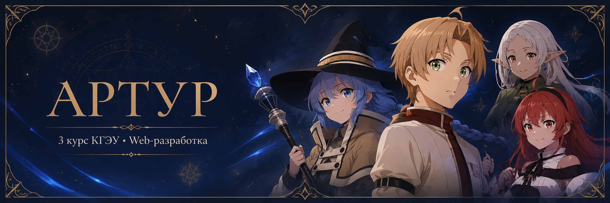
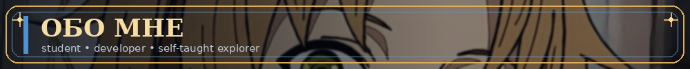
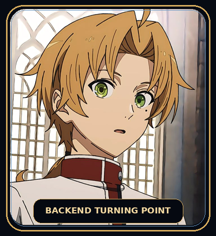
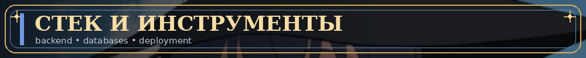
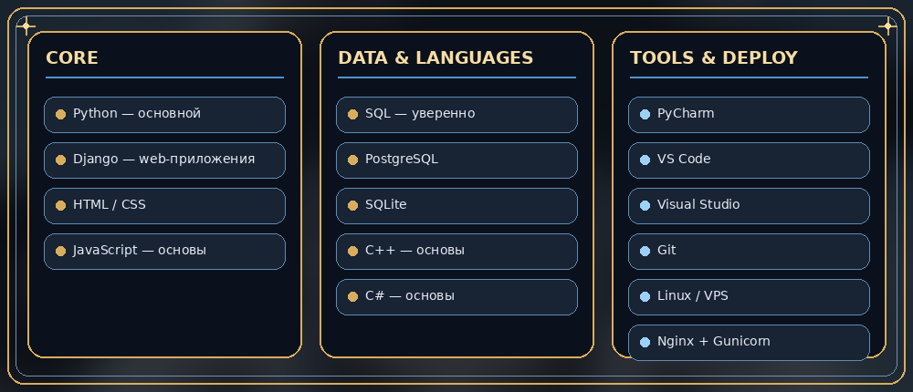
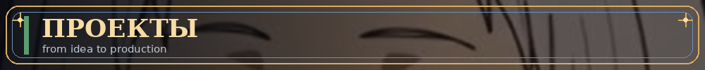
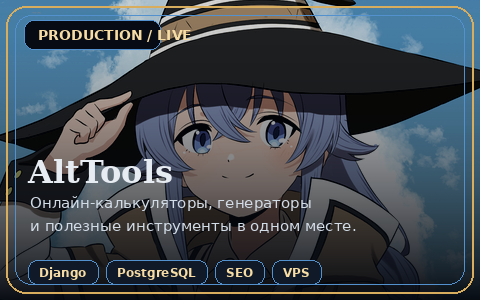
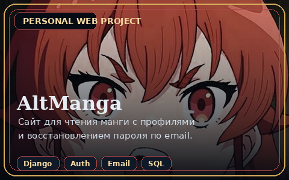
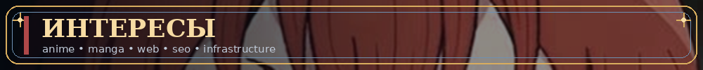
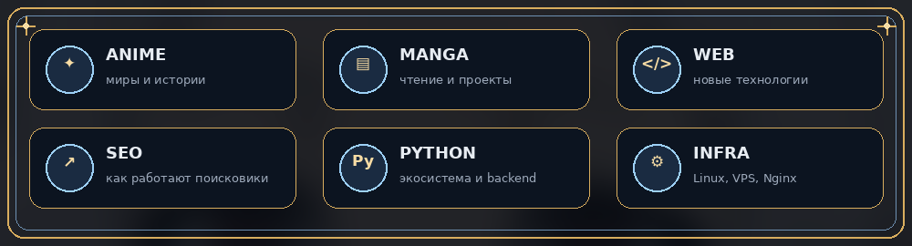

 

 

<table>
<tr>
<td width="64%" valign="top">

### Привет, я Артур 👋

Мне **20 лет**, я учусь на **3-м курсе КГЭУ** по направлению **«Web-разработка»**.

Моё основное направление — backend-разработка на **Python и Django**. Умею создавать полноценные веб-приложения с нуля: от моделей и бизнес-логики до авторизации, базы данных и развёртывания на сервере.

- 🐍 Основной язык — **Python**
- 🌐 Основной фреймворк — **Django**
- 🗄️ Работаю с **SQLite и PostgreSQL**
- 🐧 Настраиваю **VPS, Linux, Nginx и Gunicorn**
- 🔧 Использую **Git**
- 🧠 Люблю самостоятельно разбираться в новых технологиях
- 🔍 Интересуюсь SEO, поисковыми системами и внутренним устройством веб-приложений

> Мне интересно не только заставить приложение работать, но и понять, **почему оно работает именно так**.

</td>
<td width="36%" align="center" valign="middle">

</td>
</tr>
</table>

 

<b>Подробнее о навыках</b>

 

| Направление | Что умею |
|---|---|
| **Python / Django** | Разработка полноценных веб-приложений с нуля, модели, views, templates, формы, авторизация |
| **JavaScript** | Основы языка и клиентской логики |
| **C++ / C#** | Базовые знания синтаксиса и принципов программирования |
| **SQL** | Запросы и работа с SQLite и PostgreSQL |
| **Deploy** | VPS, Linux, Nginx, Gunicorn, домены и запуск Django-проектов |
| **Инструменты** | PyCharm, VS Code, Visual Studio, Git |

 

<table>
<tr>
<td width="50%" align="center" valign="top">

### [AltTools](https://alttools.ru)

Мой основной готовый проект — сборник полезных онлайн-инструментов: кредитные и ипотечные калькуляторы, ИМТ, проценты, калории, генераторы и другие утилиты.

`Django` `PostgreSQL` `VPS` `Nginx` `Gunicorn` `SEO`

**Статус:** работает в production, развёрнут на VPS и индексируется поисковиками.

</td>
<td width="50%" align="center" valign="top">

### AltManga

Веб-сайт для чтения манги с системой пользовательских профилей и восстановлением пароля по электронной почте.

`Django` `Auth` `Email` `SQL` `Web`

**Статус:** личный веб-проект.

</td>
</tr>
</table>

 

 

### Что мне особенно интересно

- развитие в **Python и Django**;
- устройство поисковых систем и практическое **SEO**;
- серверная инфраструктура и развёртывание приложений;
- архитектура веб-приложений и процессы «под капотом»;
- аниме и манга.

 

 

Profile design inspired by the fantasy atmosphere of Mushoku Tensei.

